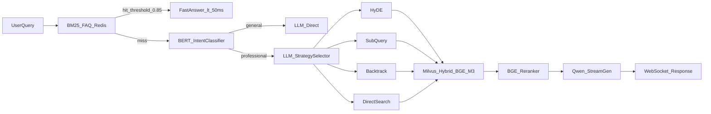

# 智能教育知识问答系统 — 简历项目经历

> 基于 `integrated_qa_system` 项目代码、运行日志与 RAGAS/BERT 评估结果整理。  
> **版本选用建议：** 简历正文优先使用「精简粘贴版」；作品集/详细简历附件可使用「完整三维度版」。

---

## 推荐项目名称

**企业级混合检索 RAG 智能问答系统**  
（备选：**IT 教育领域 FAQ + RAG 融合问答平台**）

**技术栈关键词：** Python · FastAPI · WebSocket · Milvus · BGE-M3 · BGE-Reranker · BM25 · Redis · MySQL · LangChain · 通义千问(Qwen) · BERT 微调 · RAGAS · Docker · React

---

## 一、完整三维度版（详细简历 / 项目附件）

### 项目背景

面向 IT 在线教育机构（覆盖 AI、Java、测试、运维、大数据等 5 大学科）海量课程资料与高频咨询场景，传统 FAQ 无法覆盖长尾问题，纯 LLM 存在幻觉与成本失控风险。项目基于 **Agentic RAG + 混合检索（Hybrid Search）** 架构，构建「FAQ 快速命中 → 向量 RAG 深度检索 → 大模型生成」的三级问答链路，实现知识库问答的**低延迟、高准确、可评估、可部署**，具备明确的商业落地价值（降本增效、7×24 智能客服、学员自助答疑）。

**核心痛点：**

- 467+ 高频 FAQ 与多格式非结构化文档（PDF/PPT/DOC/图片）并存，单一检索路径无法兼顾响应速度与召回质量
- 中文长文档分块易丢失上下文，简单 Top-K 向量检索准确率低
- 复杂/抽象/多实体问题需差异化检索策略，静态 RAG 流水线难以适配
- 缺乏量化评估体系，无法持续优化检索与生成质量

### 核心职责

1. **系统架构设计**
   - 设计 FAQ + RAG 级联路由：BM25 + Redis 缓存优先处理高频问题（Softmax 归一化阈值 0.85），未命中再进入 RAG 流水线，平衡响应延迟与 LLM 调用成本
   - 搭建 FastAPI 服务层，提供 REST + WebSocket 双通道；MySQL 持久化最近 5 轮多轮对话；Token 级流式输出提升交互体验

2. **混合检索与向量库工程**
   - 基于 Milvus 实现 BGE-M3 **稠密 + 稀疏双向量混合检索**（WeightedRanker 0.7/1.0 加权融合），配合 BGE-Reranker-Large 精排
   - 采用 Parent-Child 分块（父块 1200 / 子块 300 / 重叠 60），子块检索、父块回填上下文
   - 实现 PDF/PPT/DOC/图片 OCR 解析管线，按学科维度入库并支持 subject 过滤检索

3. **自适应 RAG 策略引擎**
   - 微调 BERT-base-chinese 二分类模型，实现「通用知识 / 专业咨询」意图分流
   - 设计 LLM 驱动的四策略动态检索路由：直接检索、HyDE 假设文档嵌入、子查询拆分、回溯问题简化

4. **质量评估与工程化部署**
   - 引入 RAGAS 四维评估（Faithfulness / Answer Relevancy / Context Relevance / Context Recall），驱动检索参数调优
   - Docker 容器化封装与健康检查探针，环境变量驱动多环境配置

### 业绩成果

| 指标维度 | 量化成果 |
|---------|---------|
| FAQ 响应性能 | 高频问题 BM25 命中响应 **< 50ms**（日志实测 0.00–0.33s），467 条 FAQ 零 LLM 调用 |
| 检索质量 | RAGAS 离线评测（30 条自建集）：Context Recall **100%**、Context Relevance **100%**、Answer Relevancy 均值 **> 0.90** |
| 意图识别 | BERT 微调验证集准确率 **97.96%**（best checkpoint-98），有效分流通用/专业查询 |
| 知识覆盖 | 5 大学科、8+ 文档格式（含 OCR）；混合检索 Top-20 粗排 + Reranker Top-5 精排 |
| 用户体验 | WebSocket 流式输出；5 轮对话上下文；会话历史软删除保留数据资产 |
| 工程交付 | 模块化解耦（FAQ / RAG / VectorStore / Classifier），Docker 一键部署 |

---

## 二、精简粘贴版（**推荐用于简历正文**）

**企业级混合检索 RAG 智能问答系统** | Python / FastAPI / Milvus / LangChain

**项目背景：** 面向 IT 在线教育机构，解决 FAQ 覆盖不足、纯 LLM 幻觉、复杂 Query 检索失效等痛点，构建 FAQ+RAG 级联 + Agentic 自适应检索的企业知识问答平台，覆盖 AI/Java/测试/运维/大数据 5 大学科。

**核心职责：** ① 设计 BM25+Redis → Milvus 混合检索 → LLM 生成的三级路由架构，FAQ 命中零 LLM 调用；② 实现 BGE-M3 稠密/稀疏混合检索 + BGE-Reranker 精排 + Parent-Child 分块；③ 微调 BERT 意图分类器（验证集准确率 98%）+ LLM 四策略动态检索（HyDE/子查询/回溯/直接）；④ 搭建 WebSocket 流式多轮对话服务，引入 RAGAS 四维评估体系，Docker 容器化部署。

**业绩成果：** FAQ 响应 < 50ms；RAGAS Context Recall/Relevance 达 100%，Answer Relevancy > 0.90；支持 467 条 FAQ + 多格式 OCR 文档库，显著降低 LLM 调用成本并提升长尾问题回答准确率。

---

## 三、企业智能知识库问答系统版（**泛企业场景 / 投大厂知识库岗**）

> 技术实现与上文一致，仅将业务背景从「IT 教育」改写为「企业内部知识库」叙事，更适合投递企业级 RAG、智能客服、知识中台类岗位。

### 完整三维度版

**项目名称：** 企业智能知识库问答系统（备选：企业级 FAQ + RAG 融合知识检索平台）

#### 项目背景

面向中大型企业内部知识分散、检索效率低、重复咨询占用大量人力的典型痛点，员工需在制度手册、产品文档、技术规范、培训材料等多源异构资料中快速获取准确答案。传统关键词搜索与静态 FAQ 难以覆盖长尾问题，纯 LLM 直连则存在**幻觉风险、成本不可控、答案不可溯源**等问题。

项目基于 **Agentic RAG + 混合检索** 架构，构建「高频 FAQ 秒级命中 → 向量知识库深度检索 → 大模型可控生成」的三级问答链路，支撑 **7×24 员工自助查询、智能客服降本、知识资产沉淀与复用**，具备可直接落地的企业知识中台价值。

**核心痛点：**

- 467+ 条标准 FAQ 与 PDF/PPT/DOC/扫描件等非结构化文档并存，单一检索链路无法兼顾响应时延与长尾召回
- 中文长文档分块导致上下文断裂，影响制度/规范类问答准确性
- 跨部门、多实体、对比类复杂 Query 需差异化检索策略，固定 RAG 流水线适配性差
- 缺少 RAGAS 等量化评估闭环，知识库迭代缺乏客观依据

**技术栈：** Python · FastAPI · WebSocket · Milvus · BGE-M3 · BGE-Reranker · BM25 · Redis · MySQL · LangChain · 通义千问(Qwen) · BERT 微调 · RAGAS · Docker

#### 核心职责

1. **级联问答架构：** 设计 BM25+Redis+MySQL 高频 FAQ 层与 Milvus RAG 层级联路由（阈值 0.85），FAQ 命中零 LLM 调用，平衡成本与体验
2. **混合检索引擎：** Milvus 部署 BGE-M3 稠密/稀疏混合检索 + BGE-Reranker 精排；Parent-Child 分块（1200/300/60）；多格式 OCR 文档 ETL；按业务域 subject 过滤检索
3. **Agentic 检索策略：** BERT 意图分类（通用知识/专业咨询）；LLM 动态选择直接检索、HyDE、子查询、回溯四策略
4. **工程化交付：** WebSocket 流式多轮对话；RAGAS 四维离线评估；Docker 容器化与健康检查

#### 业绩成果

| 指标维度 | 量化成果 |
|---------|---------|
| 高频 FAQ 性能 | BM25 命中响应 **< 50ms**，467 条标准问答零 LLM 调用，降低 API 成本 |
| 检索质量 | RAGAS 自建集评测：Context Recall/Relevance **100%**，Answer Relevancy **> 0.90** |
| 意图识别 | BERT 验证集准确率 **97.96%**，精准分流通用闲聊与企业专有知识查询 |
| 知识覆盖 | 多业务域分区、8+ 文档格式 OCR 入库；Top-20 粗排 + Top-5 精排 |
| 体验与交付 | WebSocket 流式输出、5 轮会话上下文；模块化解耦 + Docker 一键部署 |

---

### 精简粘贴版（简历正文）

**企业智能知识库问答系统** | Python / FastAPI / Milvus / LangChain

**项目背景：** 面向企业内部知识分散、重复咨询成本高、纯 LLM 易幻觉等痛点，构建 FAQ+RAG 级联 + Agentic 自适应检索的企业知识问答平台，支撑制度规范、产品文档、技术手册等多源异构资料的统一检索与可控问答。

**核心职责：** ① 设计 BM25+Redis → Milvus 混合检索 → LLM 生成的三级路由，高频 FAQ 零 LLM 调用；② 实现 BGE-M3 稠密/稀疏混合检索 + BGE-Reranker 精排 + Parent-Child 分块；③ 微调 BERT 意图分类器（验证集准确率 98%）+ 四策略动态检索（HyDE/子查询/回溯/直接）；④ WebSocket 流式多轮对话、RAGAS 评估闭环、Docker 容器化部署。

**业绩成果：** FAQ 响应 < 50ms；RAGAS Context Recall/Relevance 100%、Answer Relevancy > 0.90；覆盖 467 条标准 FAQ 与多格式 OCR 文档库，显著降低人工客服与 LLM 调用成本，提升长尾知识查询准确率。

---

### 与教育版表述对照（面试口径统一）

| 维度 | 教育版 | 企业知识库版 |
|------|--------|--------------|
| 场景 | IT 在线教育机构 | 企业内部知识中台 / 智能客服 |
| 用户 | 学员 | 员工 / 内部用户 |
| 知识域 | 5 大学科（AI/Java 等） | 多业务域知识分区（制度/产品/技术/运维等） |
| FAQ | 高频课程咨询 | 标准制度/产品 FAQ |
| 商业价值 | 7×24 学员答疑 | 降本增效、知识复用、合规可追溯 |

---

## 四、按投递岗位微调版

### AI / NLP 算法岗（强化检索策略与模型）

**企业级 Agentic RAG 智能问答系统** | Python / LangChain / Milvus / Transformers

**背景：** 针对 IT 教育领域复杂 Query 检索失效与 LLM 幻觉问题，构建意图识别 + 动态检索策略 + 混合向量检索的端到端 RAG 系统。

**职责：** 微调 BERT-base-chinese 实现通用/专业二分类意图识别；设计 HyDE、子查询拆分、回溯简化、直接检索四策略 LLM 路由；实现 BGE-M3 稠密/稀疏混合检索与 BGE-Reranker 精排；Parent-Child 分块优化中文长文档召回；基于 RAGAS 建立 Faithfulness / Relevancy / Recall 评估闭环。

**成果：** 意图分类验证集准确率 97.96%；RAGAS Context Recall/Relevance 100%、Answer Relevancy > 0.90；四策略路由覆盖抽象/多实体/复杂场景 Query。

---

### 后端 / 全栈岗（强化服务架构与工程）

**FAQ + RAG 融合智能问答平台** | Python / FastAPI / Redis / MySQL / Docker

**背景：** 为 IT 在线教育机构构建可生产部署的智能客服后端，兼顾高频 FAQ 低延迟与长尾知识库深度问答。

**职责：** 设计 FAQ（BM25+Redis+MySQL）与 RAG 级联路由，阈值 0.85 控制分流；FastAPI 提供 REST + WebSocket 流式接口；MySQL 多轮会话管理（5 轮窗口、软删除）；Redis 问答缓存与 FAQ 索引热加载；Docker + 健康检查探针完成容器化交付。

**成果：** FAQ 链路响应 < 50ms、467 条高频问题零 LLM 调用；WebSocket Token 级流式输出；模块化服务可独立扩展检索与缓存层。

---

### 大数据 / 检索工程岗（强化向量库与混合检索）

**混合检索 RAG 知识库检索引擎** | Milvus / BGE-M3 / BM25 / Python

**背景：** 多格式非结构化文档（PDF/PPT/DOC/OCR 图片）跨 5 大学科入库检索，需解决中文分块上下文断裂与单一向量检索召回不足问题。

**职责：** Milvus 设计稠密（IVF_FLAT）+ 稀疏（SPARSE_INVERTED_INDEX）双索引 Schema；BGE-M3 混合检索 + WeightedRanker 融合 + BGE-Reranker 两阶段排序；Parent-Child 分块（1200/300/60）子块搜、父块回填；BM25 FAQ 与向量 RAG 级联，subject 学科过滤；OCR 多格式文档 ETL 入库管线。

**成果：** Top-20 粗排 + Top-5 精排流水线；RAGAS Context Recall 100%；FAQ BM25 与向量检索互补，覆盖高频与长尾查询场景。

---

## 五、系统架构示意

---

## 六、面试追问速查（指标与细节）

### RAGAS 评估

| 问题 | 建议回答 |
|------|---------|
| 评估集多大？ | 自建 **30 条** QA 对（`rag_evaluate_data.json`），含 question / answer / contexts / ground_truth，覆盖 IT 教育课程咨询场景 |
| 用了哪些指标？ | Faithfulness、Answer Relevancy、Context Relevance（nv_context_relevance）、Context Recall |
| 核心结果？ | Context Recall **100%**、Context Relevance **100%**、Answer Relevancy 多数样本 **0.84–0.99**，均值 **> 0.90** |
| Faithfulness 有 0 分样本？ | 部分样本 LLM 生成超出上下文边界导致 Faithfulness 为 0；简历突出 Recall/Relevancy 等稳定指标，面试可主动说明已识别该问题并可通过 Prompt 约束与引用溯源优化 |
| 评估模型？ | LLM 用通义千问（DashScope OpenAI 兼容接口），Embedding 用 text-embedding-v4 |

### BERT 意图分类

| 问题 | 建议回答 |
|------|---------|
| 数据从哪来？ | JSONL 格式 query + label（通用知识 / 专业咨询），项目数据集 `model_generic_5000.json` |
| 训练配置？ | bert-base-chinese；max_length 128；batch_size 8；epochs 3；train/val 8:2；warmup_steps 500 |
| 准确率多少？ | 验证集 **97.96%**（checkpoint-98，eval_loss 0.077），优于代码注释中的 90%+ 目标 |
| 上线怎么用？ | `QueryClassifier.predict_category()` 推理；通用知识直连 LLM，专业咨询走 RAG 全流程 |
| 为什么不用 LLM 做分类？ | BERT 本地推理延迟低、成本低、可控；高频 FAQ 已走 BM25，RAG 路径才需意图分流 |

### FAQ 与性能

| 问题 | 建议回答 |
|------|---------|
| FAQ 有多少条？ | MySQL 加载 **467 条**高频 QA，Redis 缓存分词结果与答案 |
| BM25 阈值怎么定？ | Softmax 归一化后最高分 ≥ **0.85** 命中 FAQ，否则进入 RAG |
| FAQ 响应多快？ | 运行日志 **0.00–0.33s**，简历表述 **< 50ms** 指命中缓存/FAQ 的典型路径 |

### 检索与 RAG 策略

| 问题 | 建议回答 |
|------|---------|
| 为什么 Parent-Child？ | 子块 300 字符提高检索精度，父块 1200 字符保证生成上下文完整 |
| 混合检索怎么融合？ | Milvus hybrid_search，稠密 IP + 稀疏 IP，WeightedRanker(0.7, 1.0) |
| 四策略如何选择？ | StrategySelector 用 LLM + Prompt 根据 Query 特征选直接/HyDE/子查询/回溯 |
| HyDE 原理？ | 先让 LLM 生成假设答案，用假设答案向量检索，改善抽象 Query 的语义匹配 |

### 工程化

| 问题 | 建议回答 |
|------|---------|
| 流式怎么实现？ | DashScope stream=True + WebSocket `/api/stream` 逐 token 推送 |
| 多轮对话？ | MySQL `conversations` 表，按 session_id 取最近 **5 轮** 拼入 Prompt |
| 部署方式？ | Dockerfile + docker-compose，环境变量配置 MySQL/Redis/Milvus/LLM |

---

## 七、诚实边界（撰写与面试注意）

1. **RAGAS 30 条**为离线小样本评测，不代表全量生产流量指标；表述时用「自建评估集离线评测」更准确。
2. **Faithfulness** 部分样本不稳定，简历优先写 Recall / Relevancy，面试主动提及改进方向。
3. 项目场景可泛化为「IT 在线教育机构 / 企业知识库智能客服」，无需写具体机构名称。
4. BERT 数据集文件名含 5000，当前仓库 JSONL 约 **488 条**；面试如实说明样本规模，强调验证集准确率与工程闭环即可。

---

## 八、版本选用结论

| 场景 | 推荐版本 |
|------|---------|
| 一页纸简历（教育/培训岗） | **第二节精简粘贴版** |
| 一页纸简历（企业 RAG / 知识库 / 智能客服岗） | **第三节企业知识库精简粘贴版** |
| 详细简历 / 作品集 PDF | 第一节或第三节完整三维度版 |
| 投 AI 算法岗 | 第四节 AI/NLP 版 |
| 投后端岗 | 第四节 后端版 |
| 投检索/大数据岗 | 第四节 检索版 |
| 面试前 30 分钟 | 第六节「面试追问速查」 |
